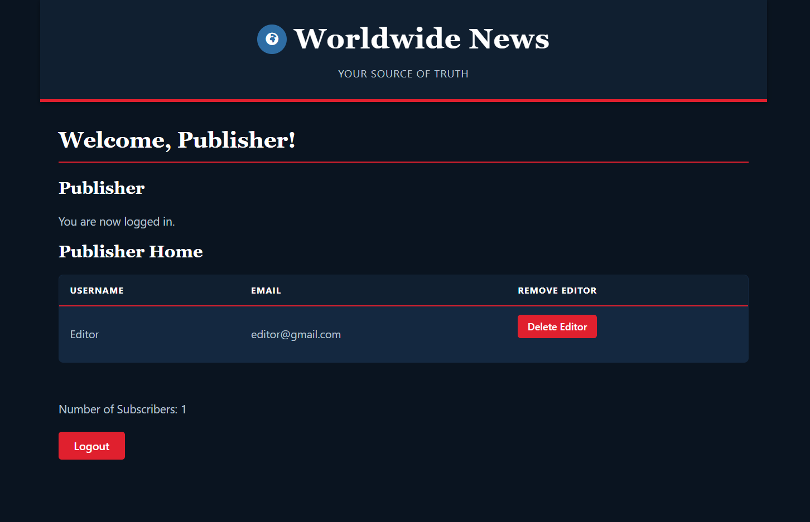
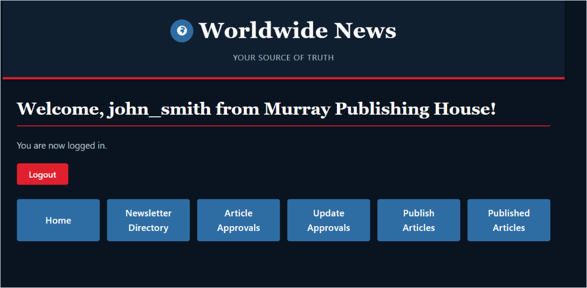
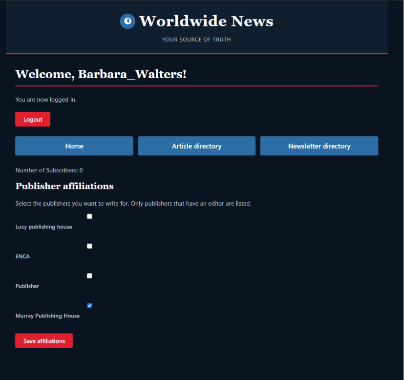
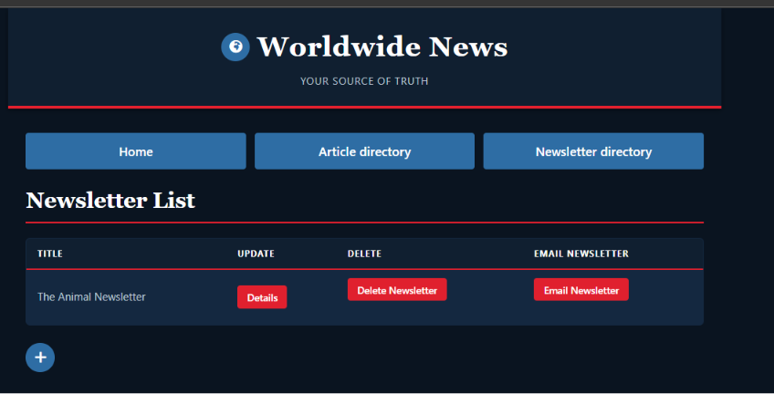
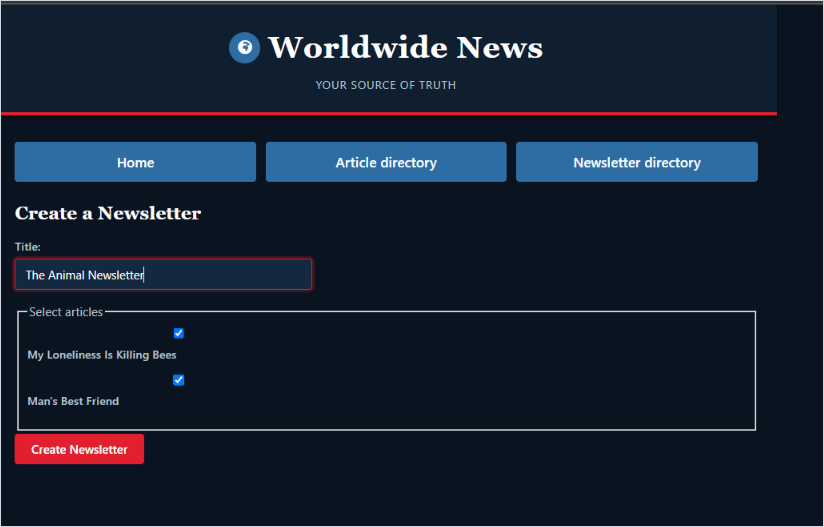
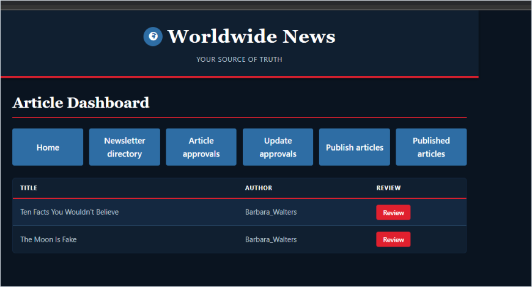
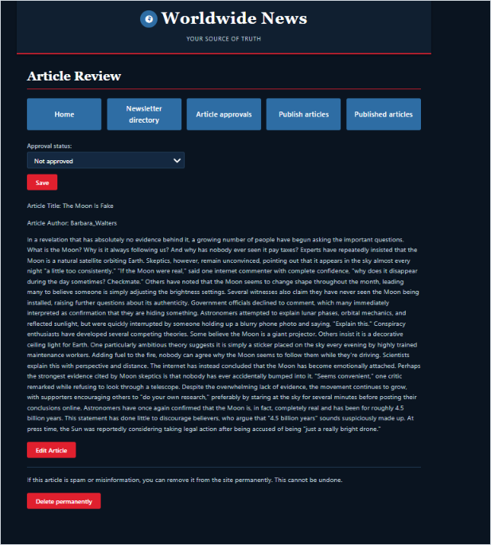
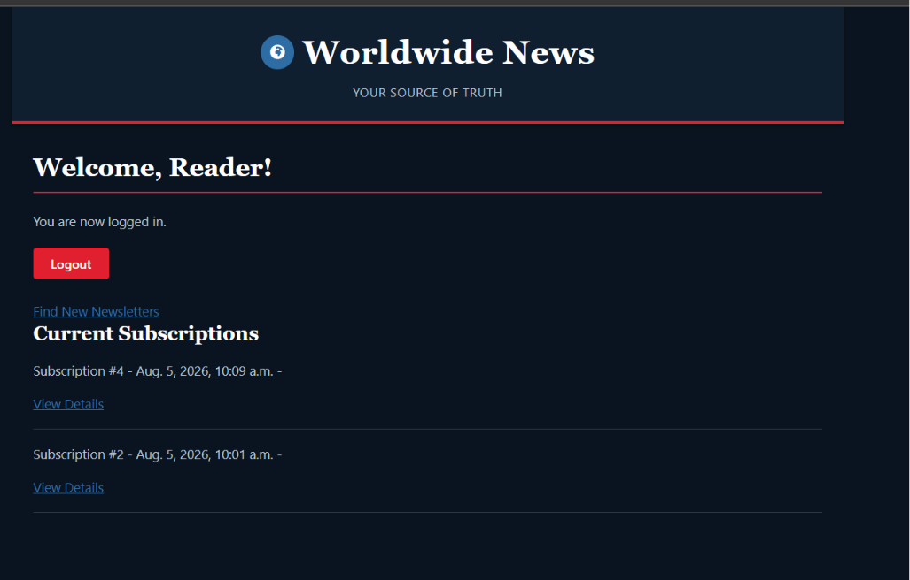
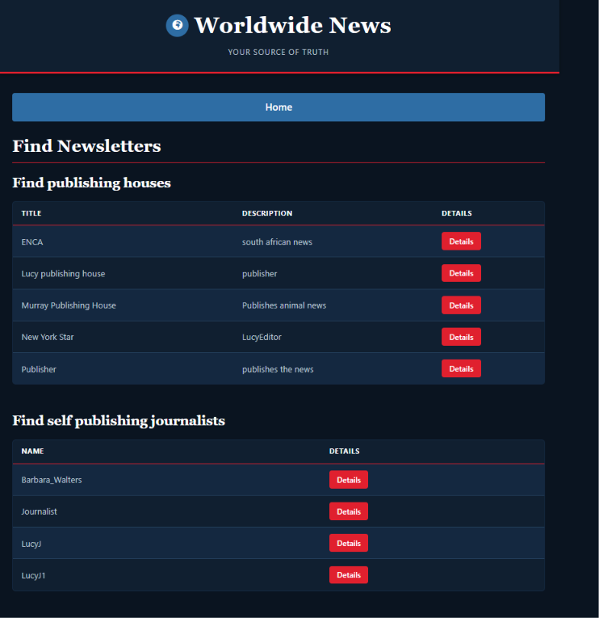

# News Application

A Django news platform where journalists write articles, editors approve and
publish them on behalf of a publishing house, and readers subscribe to
publishers or journalists to read the articles they care about. The project
also exposes a small REST API (Django REST Framework) for approved articles.

---

## Tech stack

- **Python / Django 6.0**
- **Django REST Framework** for the API
- **MariaDB / MySQL** as the database (via `mysqlclient`)
- **python-dotenv** for environment configuration

See [requirements.txt](news_site/requirements.txt) for the full pinned list.

---

## Project layout

```
M06T08 – Capstone Project – News Application/
├── README.md            ← you are here
└── news_site/           ← Django project root (run all commands from here)
    ├── manage.py
    ├── requirements.txt
    ├── news_site/       ← settings, root URLs, WSGI
    └── news/            ← the news app (models, views, urls, tests, API)
```

> **Run every command below from the `news_site/` directory** (the folder that
> contains `manage.py`).

---

## Getting started

### 1. Create and activate a virtual environment

```powershell
cd news_site
python -m venv venv
venv\Scripts\activate          # Windows (PowerShell)
# source venv/bin/activate     # macOS / Linux
```

### 2. Install dependencies

```powershell
pip install -r requirements.txt
```

### 3. Configure the database

The project uses **MariaDB / MySQL**. Create a database, then add a `.env` file
next to `manage.py` with your credentials:

```
DB_NAME=news_db
DB_USER=news_user
DB_PASSWORD=your_password
```

The database settings are read from these variables in
[news_site/settings.py](news_site/news_site/settings.py). The host is
`localhost` and the port is `3306`.

> **Note for running tests:** Django creates a throwaway *test* database, so the
> `DB_USER` you configure needs `CREATE` and `DROP` privileges or
> `manage.py test` will fail during setup.

### 4. Apply migrations

```powershell
python manage.py migrate
```

### 5. Run the development server

```powershell
python manage.py runserver
```

Then open http://127.0.0.1:8000/ in your browser.

Email (password resets, newsletter sends) uses Django's **console backend** in
development, meaning messages are printed to the terminal running the server -
no real mail account is required.

---

## Roles and the sign-up flow

Anyone can sign up straight from the **login page** - every role has its own
"Sign Up As…" button, so no command-line or admin setup is needed to get
started. A publisher only needs to exist before an editor can join it, so the
natural order is to register a publisher first.

### 1. Register a Publisher (on the login page)

A **publisher** (publishing house) now signs up directly via **Sign Up As A
Publisher** on the login page - no admin involvement required. They pick a
title, description, username and password, are logged straight in, and land on
the **publisher home page**. Removing publishers and editors is handled by an
admin from the admin home page (see [Admins](#admins-optional-moderation)
below).
#### Publisher Homepage



### 2. Register an Editor (belongs to a publisher)

Once at least one publisher exists, an **editor** can register via **Sign Up As
A Editor**, choosing the publishing house they belong to. Editors review and
approve the articles written under their publisher.
#### Editor Homepage


### 3. Register a Journalist (writes articles)

A **journalist** registers via **Sign Up As A Journalist** and can write
articles. New articles start out unapproved if published by a publishing house. 
Journalists can group articles together into newsletters.
#### Journalist Homepage

#### Newsletter Directory

#### Newsletter Creation


### 4. Editor approves the articles

An article written by a journalist must be **approved by an editor** before it
is published. Editors use their approvals dashboard to review and approve (or
reject) articles for their publishing house.
#### Article Dashboard

#### Article Review


### 5. Readers read the articles

A **reader** registers via **Sign Up As A Reader**, subscribes to publishers
and/or journalists, and can then read the approved/published articles from those
subscriptions.
#### Reader Homepage

#### Find Newsletters


## REST API

Approved-article endpoints are available under `/api/` (see
[news/urls.py](news_site/news/urls.py) for the full list), including:

| Endpoint                          | Purpose                              |
| --------------------------------- | ------------------------------------ |
| `GET  /api/articles/`             | List approved articles               |
| `GET  /api/articles/<id>/`        | Retrieve a single article            |
| `POST /api/articles/create/`      | Create an article                    |
| `GET  /api/articles/subscribed/`  | Articles from your subscriptions     |
| `GET  /api/approved/`             | Approved-article log                 |

The API uses HTTP Basic authentication and DRF's browsable API renderer, so you
can explore it in the browser or with a tool like Postman.

---

## Running the tests

Automated tests for the REST API and the role-based logic live in
[news/tests.py](news_site/news/tests.py). From the `news_site/` directory:

```powershell
# Run the full test suite for the news app
python manage.py test news

# Run with more detail
python manage.py test news --verbosity 2
```

As noted above, the test runner builds a temporary database, so the `DB_USER`
in your `.env` must have `CREATE` and `DROP` privileges.

## Running with Docker

The project ships with a `Dockerfile` and `docker-compose.yml` that run the
Django app and a **MariaDB** database together in containers. Run all commands
from the `news_site/` directory (the folder containing `docker-compose.yml`).

### 1. Configure the environment file

As with the local setup, configuration is read from a `.env` file, which is
**not** committed to the repository for security. The Docker setup needs a few
extra variables compared with the local one. Create a `.env` file next to
`docker-compose.yml` with the following:

```
DB_NAME=news_db
DB_USER=news_user
DB_PASSWORD=your_password
DB_ROOT_PASSWORD=your_root_password
DB_HOST=db
ALLOWED_HOSTS=localhost,127.0.0.1
```

> **Important:** `DB_HOST` must be set to `db` (the name of the database service
> in `docker-compose.yml`) so the app container can reach the database over the
> Docker network. For the local (non-Docker) setup, `DB_HOST` is `localhost`
> instead. `DB_ROOT_PASSWORD` is used by MariaDB to initialise the server.

### 2. Build and start the containers

```powershell
docker-compose up --build
```

This builds the image and starts both the `web` and `db` services. Once running,
the app is available at http://localhost:8000/.

> **First-run note:** on the very first start, the database needs a few seconds
> to initialise. If the `web` container reports a database connection error
> while `db` is still starting up, simply restart the web service once the
> database is ready:
>
> ```powershell
> docker-compose restart web
> ```

### 3. Accessing from a different host

If you are running the app somewhere other than `localhost` (for example, on a
remote machine or an online playground), add that hostname to `ALLOWED_HOSTS`
in your `.env` file before starting, e.g.:

```
ALLOWED_HOSTS=localhost,127.0.0.1,your-host-name.example.com
```

### 4. Stop the containers

```powershell
docker-compose down
```